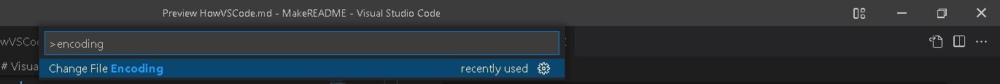

# Visual Studio Code の使い方
sry for MC user......

## ショートカット

### 本当の本当に基本
```VSCode
「Ctrl」+「S」: 保存
「Ctrl」+「C」: コピー
「Ctrl」+「V」: ペースト
「Ctrl」+「A」：すべて選択
「Ctrl」+「F」: 検索
「Ctrl」+「←→」: 単語単位でカーソルを移動
「Shift」+「←→」：カーソルで文章を選択
```

### よく使うショートカット
```VSCode
「Ctrl」+「Shift」+「P」: コマンドパレットを開く
「Ctrl」+「+」: 拡大
「Ctrl」+「-」: 縮小
```

### 便利
```VSCode
「Ctrl」+「A」：すべて選択
「Ctrl」+「/」：行をコメントアウト・解除
「Ctrl」+「Space」：サジェスト表示
「F12」：選択部分のdefに移動
「Ctrl」+「F12」：選択部分の実装位置に移動
「Alt」+「F12」：選択部分の定義をプレビュー
「Shift」+「Alt」+「F」：コードの整形
「Alt」+ クリック：マルチカーソル
「Alt」+ 「Ctrl」+「←→」：マルチカーソル

「Shift」+「Ctrl」+「V」: マークダウン記法のプレビュー
「Shift」+「Ctrl」+「M」: 開発環境の立ち上げ

```
E:\OneDrive - Kyushu University\ToolBox\MakeREADME\.miyanote

## コマンドパレットの使い方 
### 文字化けしているとき
```VSCode
「Ctrl」+ 「Shift」+「P」：コマンドパレットを開く
 コマンドパレットに「encoding」と入力
 あとは指示に従って選択する．
```



## 参考
* [VS Code基本ショートカット集30選【初心者必見！】](https://www.whizz-tech.co.jp/3243/)
* [【作業効率UP】vscode コマンド パレット・ショートカットキーを使いこなす](https://digitor.jp/textbook/vscode-command-palette/#i-3)